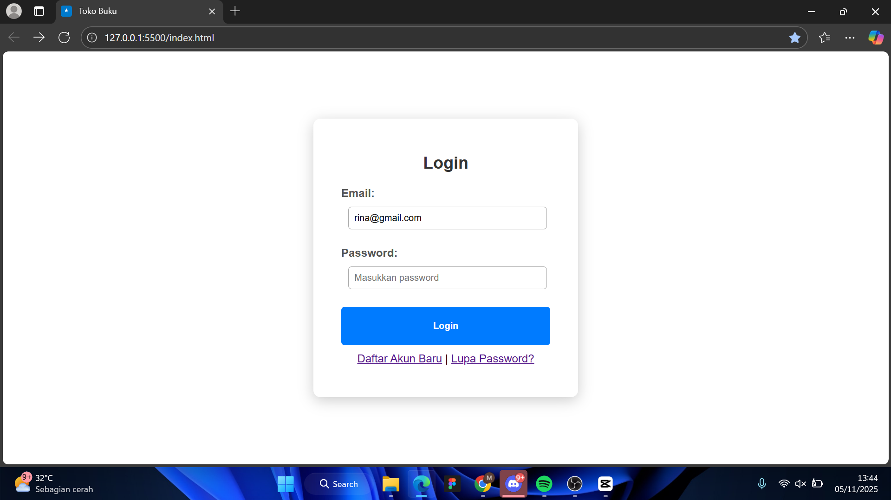
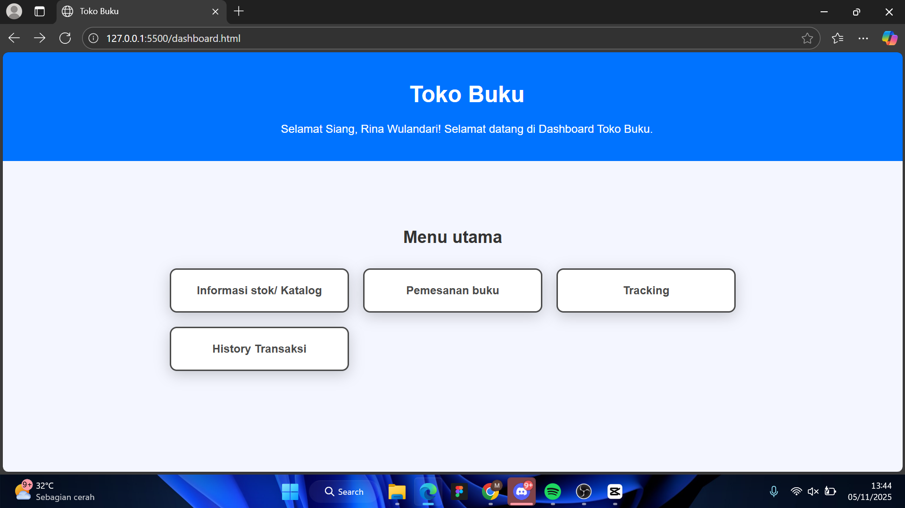
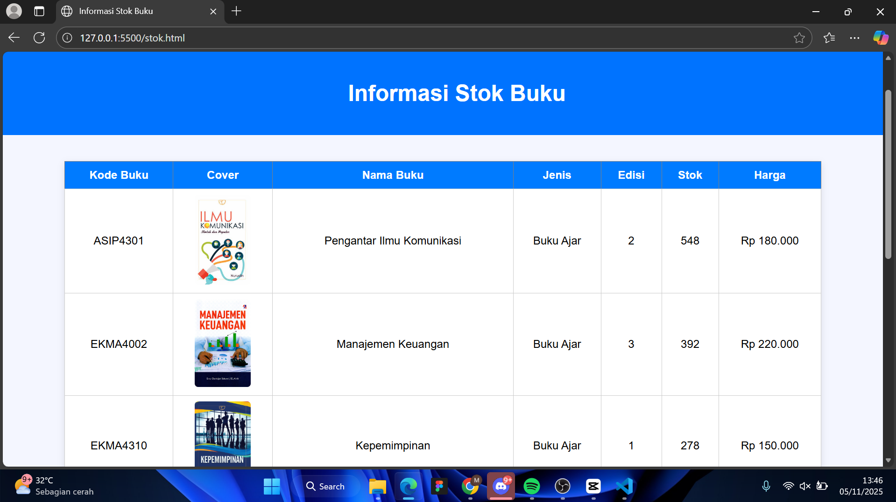
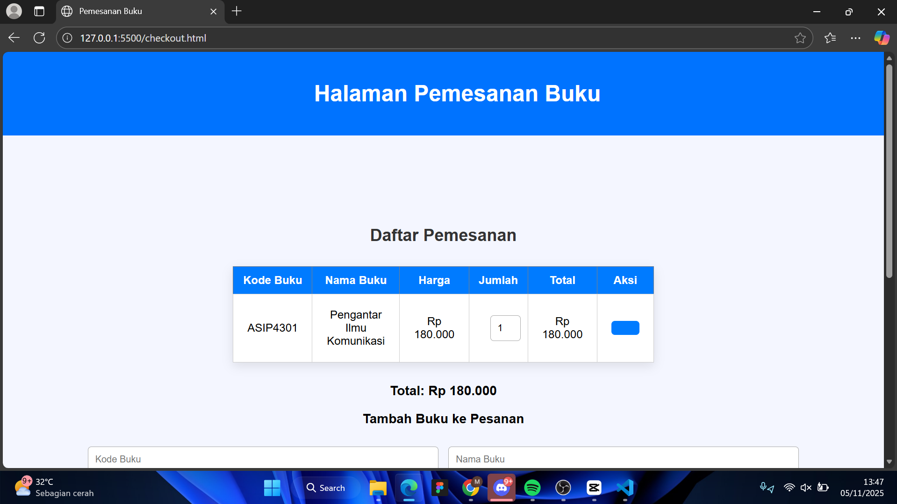
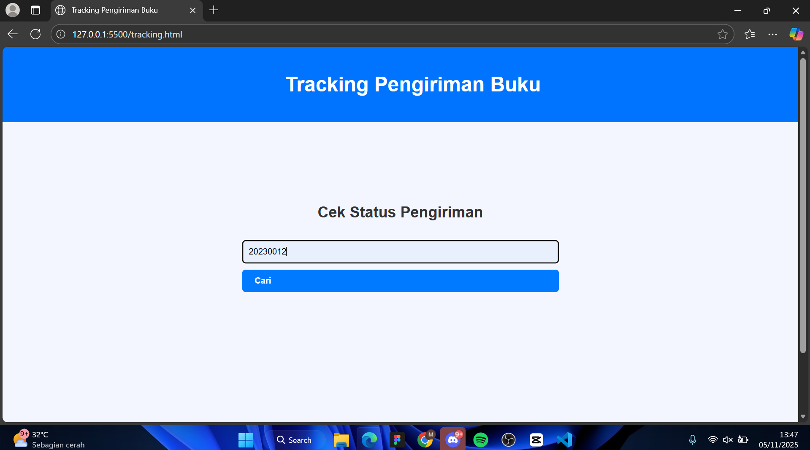
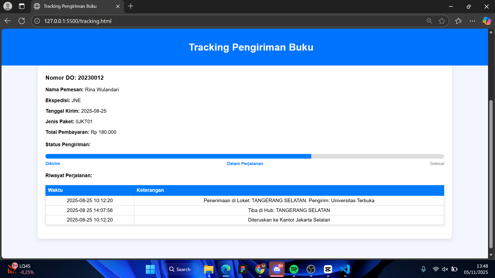

- Nama : Muhamad Nikmal Wahid
- kelas : TI 24 a3
- Pemrograman Web

# UTS Pemrograman Web-1
## Login Page 

Halaman login ini merupakan tampilan awal dari aplikasi pemesanan buku yang berfungsi untuk memverifikasi data pengguna sebelum masuk ke sistem. Pada halaman ini terdapat dua input utama, yaitu email dan password, serta satu tombol “Login” yang terhubung dengan fungsi JavaScript untuk melakukan validasi data dari file data.js. Jika data yang dimasukkan sesuai, maka akan muncul notifikasi “Login berhasil” dan pengguna diarahkan ke halaman dashboard. Namun, jika data tidak sesuai, sistem akan menampilkan peringatan bahwa email atau password salah. Tampilan form dibuat sederhana, bersih, dan terpusat dengan warna biru dominan agar terlihat profesional dan mudah digunakan.

## Dashboard page

Halaman dashboard berfungsi sebagai pusat navigasi utama setelah pengguna berhasil login. Pada halaman ini ditampilkan sapaan otomatis yang menyesuaikan waktu lokal, seperti “Selamat Pagi”, “Selamat Siang”, atau “Selamat Malam”, serta menampilkan nama pengguna yang sedang aktif menggunakan data dari localStorage. Selain itu, halaman ini berisi menu navigasi menuju halaman lain, yaitu informasi stok atau katalog buku, pemesanan, tracking pengiriman, dan history transaksi. Tampilan dashboard dibuat sederhana namun responsif dengan header dan footer tetap di posisi atas dan bawah menggunakan CSS, sehingga memberikan kesan rapi dan mudah digunakan.

## Halaman Katalog

Halaman katalog menampilkan daftar stok buku yang tersedia di toko, diambil secara dinamis dari data dummy dataKatalogBuku yang disimpan dalam file data.js. Data tersebut dimasukkan ke tabel secara otomatis menggunakan JavaScript DOM, dan pengguna juga dapat menambahkan stok baru dengan mengisi data melalui prompt yang akan langsung menambah baris tabel. Halaman ini menunjukkan penerapan manipulasi DOM untuk menampilkan dan mengelola data tanpa menggunakan database, serta memperlihatkan kemampuan JavaScript dalam mengubah tampilan secara real time sesuai interaksi pengguna.

## Halaman Pemesanan

Halaman pemesanan digunakan untuk mengisi data pemesan dan buku yang akan dibeli. Pengguna dapat memasukkan nama, judul buku, serta jumlah pesanan ke dalam form, lalu menekan tombol “Tambah” agar data tersebut muncul secara langsung di tabel pesanan. Proses ini menggunakan validasi JavaScript sederhana untuk memastikan tidak ada input kosong sebelum data ditambahkan. Melalui halaman ini, penerapan JavaScript DOM terlihat jelas karena sistem menambahkan elemen baru ke tabel sesuai input pengguna, menciptakan interaksi langsung antara form dan tampilan data.

## Halaman Tracking

Halaman tracking berfungsi untuk menampilkan status pengiriman pesanan berdasarkan nomor Delivery Order (DO) yang dimasukkan oleh pengguna. Setelah pengguna menginput nomor DO dan menekan tombol “Cari”, sistem akan menampilkan informasi seperti nama pemesan, status pengiriman, detail ekspedisi, tanggal kirim, jenis paket, dan total pembayaran. Status pengiriman divisualisasikan menggunakan elemen progress bar untuk menunjukkan sejauh mana proses pengiriman berjalan. Halaman ini menunjukkan kemampuan JavaScript dalam menampilkan data bersyarat dan memberikan pengalaman interaktif kepada pengguna.

## Halaman History

Halaman history menampilkan riwayat transaksi pemesanan yang telah dilakukan oleh pengguna. Data pada halaman ini bisa diambil dari array simulasi atau disimpan sementara menggunakan localStorage sebagai penyimpanan sisi klien. Tujuannya adalah memberikan gambaran kepada pengguna mengenai pesanan yang telah dilakukan sebelumnya, seperti judul buku, jumlah, harga, dan tanggal transaksi. Tampilan halaman history dibuat menyerupai tabel laporan sederhana agar mudah dibaca dan diakses, sekaligus melengkapi alur sistem toko buku dari login hingga pelacakan transaksi.
